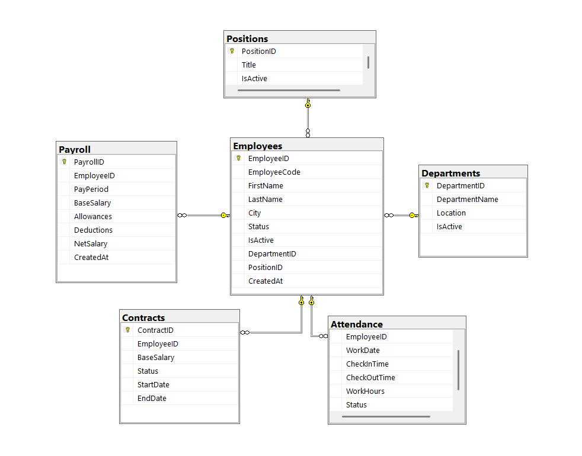

# HỆ THỐNG QUẢN LÝ NHÂN SỰ (HRM)

## Tổng quan

Đây là hệ thống quản lý nhân sự (HRM) được xây dựng nhằm mô phỏng các nghiệp vụ thực tế trong doanh nghiệp. Hệ thống cung cấp giải pháp toàn diện để theo dõi vòng đời của nhân viên từ khi gia nhập đến khi nghỉ việc.

**Các tính năng cốt lõi:**

- **Quản lý thông tin nhân viên:** Lưu trữ hồ sơ chi tiết và trạng thái làm việc.
- **Quản lý cơ cấu tổ chức:** Phân chia phòng ban và hệ thống chức vụ (Intern, Junior, Senior).
- **Theo dõi hợp đồng:** Quản lý lương cơ bản và các điều khoản lao động.
- **Chấm công hàng ngày:** Ghi nhận giờ giấc làm việc và tình trạng đi trễ/đúng giờ.
- **Quản lý lương (Payroll):** Tính toán và lưu trữ bảng lương hàng tháng.

---

## Thiết kế cơ sở dữ liệu

### Quan hệ chính giữa các bảng:

- `Departments` → `Employees` → `Contracts`
- `Positions` → `Employees`
- `Employees` → `Attendance`
- `Employees` → `Payroll`

### Mô tả chi tiết các bảng:

| Bảng            | Chức năng  | Đặc điểm kỹ thuật                                                                                          |
| :-------------- | :--------- | :--------------------------------------------------------------------------------------------------------- |
| **Employees**   | Nhân viên  | Lưu thông tin định danh, trạng thái (Đang làm việc, Nghỉ việc, Thai sản). Cột `IsActive` tự động cập nhật. |
| **Departments** | Phòng ban  | Lưu tên và địa điểm phòng ban. Một phòng có nhiều nhân viên.                                               |
| **Positions**   | Chức vụ    | Phân cấp trình độ. Một phòng ban có thể có nhiều chức danh khác nhau.                                      |
| **Contracts**   | Hợp đồng   | Lưu lương cơ bản. Giữ lịch sử dữ liệu (không xóa) ngay cả khi nhân viên đã nghỉ.                           |
| **Attendance**  | Chấm công  | Ghi nhận Check-in/Check-out, số giờ làm và trạng thái (`Present`, `Late`).                                 |
| **Payroll**     | Bảng lương | Lưu dữ liệu dưới dạng **Snapshot** (không tính toán lại khi truy vấn) để đảm bảo tính chính xác lịch sử.   |

---

## Luồng nghiệp vụ (Business Logic)

1.  **Tạo nhân viên:** Thêm hồ sơ mới, gán vào Phòng ban và Chức vụ tương ứng.
2.  **Ký hợp đồng:** Thiết lập mức lương cơ bản và liên kết trực tiếp với nhân viên.
3.  **Chấm công:** Ghi nhận dữ liệu hàng ngày để xác định số công và chuyên cần (`Present` / `Late`).
4.  **Nghỉ việc:** \* Cập nhật `Status = 'Đã nghỉ việc'`.
    - `IsActive` tự động chuyển về `0`.
    - Cập nhật `EndDate` cho hợp đồng hiện tại.
    - _Lưu ý:_ Giữ nguyên dữ liệu cũ để báo cáo thuế và bảo hiểm.
5.  **Tính lương:** \* Dựa trên **Lương cơ bản** (Hợp đồng) và **Ngày làm thực tế** (Chấm công).
    - Kết quả cuối cùng được chốt và lưu vào bảng `Payroll`.

---

**ERD**

